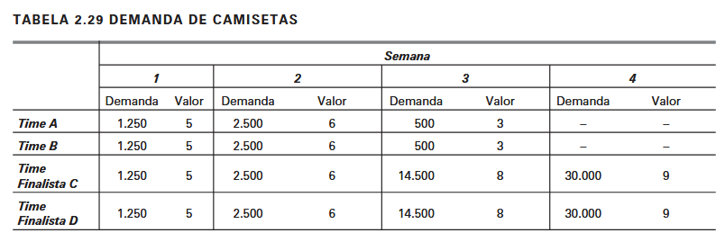

# O Problema das Camisetas

Uma certa fábrica de camisetas deseja aproveitar as finais de um campeonato de futebol para ven-der camisetas dos times envolvidos. Os jogos vão durar quatro semanas. O custo de produção decada camiseta é R$2,00 nas duas primeiras semanas e subirá para R$2,50 nas duas últimas, quandoa concorrência demandar por material no mercado. A demanda semanal de camisetas será de5.000, 10.000, 30.000 e 60.000. A capacidade máxima de produção da empresa é de 25.000 camisetas.Na primeira e na segunda semana a empresa poderá, em um esforço excepcional, carrear mão deobra em horas extras e fabricar mais 10.000 camisetas em cada semana. Nesse caso, o custo dessascamisetas será de R$2,80. O excesso de produção pode ser estocado a um custo de R$0,20 por unida-de por semana.

## Pedido 1: 
Formular o modelo de PL que minimize os custos.

## Pedido 2: 
Após o planejamento anterior, a direção da empresa verificou que a demanda iria variarsubstancialmente dentro dos quatro modelos de camiseta que representavam os quatro times dispu-tando as finais. Apesar de a demanda total ser exatamente aquela anteriormente levantada, o valordas camisetas iria variar em conformidade com o time e sua posição no campeonato. Nas duas prime-iras semanas todos os times estariam em pé de igualdade até que fosse decidido os dois finalistas. Apartir daí, as camisetas dos times eliminados cairiam em valor e em demanda no mercado, e as dos ti-mes finalistas subiriam conforme a Tabela 2.29:

Sabendo-se que existe um completo equilíbrio entre os quatro finalistas, formular o modelo que maximize os lucros da empresa produtora de camisetas.
