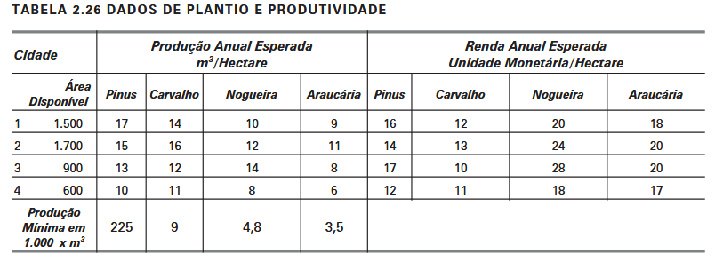

# O Problema do Reflorestamento

Uma companhia de reflorestamento possui áreas de plantio em quatro municípios. A empresa consi- dera o uso de espécies de árvores: pinus, carvalho, nogueira e araucária. A Tabela 2.26 resume os da- dos do problema:

Formule o problema de designar as áreas de plantio por município de forma a maximizar a renda.
