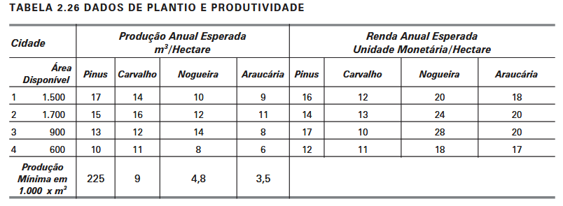

# 📊 Modelagem e Otimização com PuLP

## 📝 Descrição
Projeto desenvolvido para a disciplina de Pesquisa Operacional que consiste na implementação de um modelo matemático de otimização utilizando a biblioteca **PuLP** em Python. O principal objetivo do projeto é modelar e resolver problemas de otimização linear e combinatória aplicados a cenários reais, demonstrando o uso prático da programação matemática para a tomada de decisões.

O exercício foi retirado do livro:

> Goldbarg, M. C., & Luna, H. P. L. (2005). *Otimização combinatória e programação linear: modelos e algoritmos*. Elsevier.

---

## 🛠️ Tecnologias Utilizadas

- Python;
- [PuLP](https://pypi.org/project/PuLP/) - Biblioteca para programação linear e inteira em Python.

---

## 🌱 O Problema do Reflorestamento
Uma companhia de reflorestamento possui áreas de plantio em quatro municípios. A empresa considera o uso de espécies de árvores: pinus, carvalho, nogueira e araucária. A Tabela 2.26 resume os dados do problema:

Formule o problema de designar as áreas de plantio por município de forma a maximizar a renda.